**Introduction**

To improve the reliability, visibility, and traceability of our infrastructure management process, we are implementing a CI/CD pipeline for running our Ansible playbooks. Currently, playbooks are executed manually, which makes it difficult to track execution history, review logs, or ensure consistency across environments. By integrating Ansible with GitHub Actions, this proof of concept (PoC) demonstrates an automated workflow that executes playbooks on code changes, captures detailed run logs, and provides centralized visibility into deployment activity.

Note: This is based off of May2025(17.4) project - setting up ansible servers and nodes.

**Steps:**

If you have May2025(17.4) - I created a new folder - ansible-github - and moved terraform files so I can deploy and set up inventory infrastructure and configure ansible files automatically. Will be working from this new folder. Refer to May2025(17.4)


*In case you don't have access to May2025 and still want to get this set up - Ansible environment set-up - https://github.com/ucheor/QRS-ansible-github.git. Move into QRS-ansible-github and go straight to Terraform init step. This sets up a practice control ansible server with 2 linked ansible nodes*


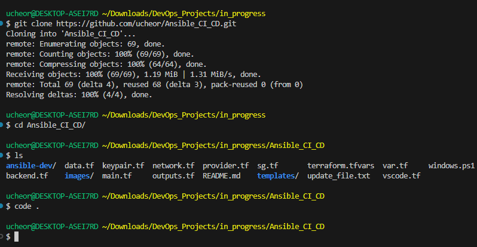

```
terraform init
terraform apply
```
'yes' to approve

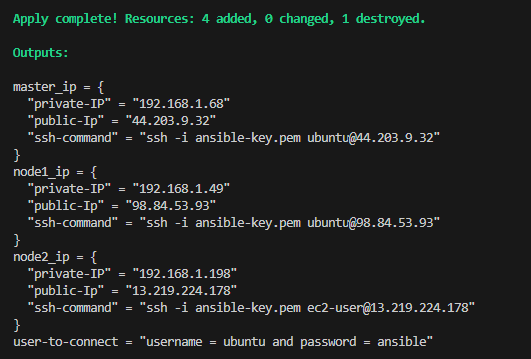

Save this output because, you might need it later. 

Move into ansible-dev (where we have our configuration and inventory files already set up) and create a playbook - install-playbook.yml

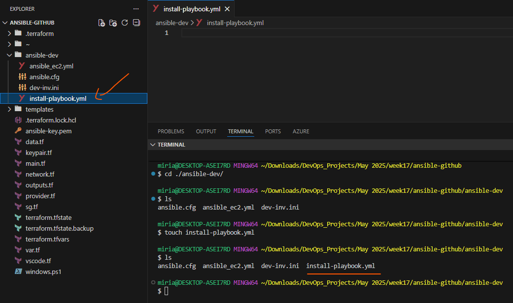

Add this text to the created playbook file

```
---
- name: install package
  hosts: all
  become: true

  tasks:
    - name: Install Apache on Ubuntu/Debian
      package:
        name: apache2
        state: present
      when: ansible_os_family == "Debian"

    - name: Install Apache on CentOS/RHEL
      package:
        name: httpd
        state: present
      when: ansible_os_family == "RedHat"

    - name: Start and enable Apache on Ubuntu/Debian
      service:
        name: apache2
        state: started
        enabled: yes
      when: ansible_os_family == "Debian"

    - name: Start and enable Apache on CentOS/RHEL
      service:
        name: httpd
        state: started
        enabled: yes
      when: ansible_os_family == "RedHat"

    - name: Create index.html with custom text
      copy:
        dest: /var/www/html/index.html
        content: |
          <html>
          <body>
            <h1>Installed using Ansible</h1>
            <p>Deployed via CI/CD pipeline - GitHub Actions</p>
          </body>
          </html>
        mode: '0644'

```
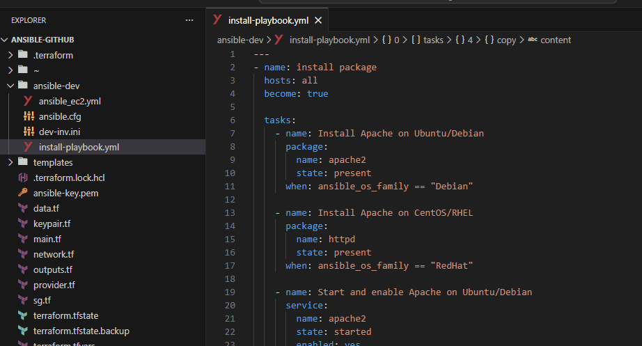

While in ansible-dev folder, create a gitHub repository and push ansible-dev folder to it

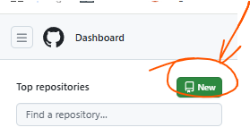

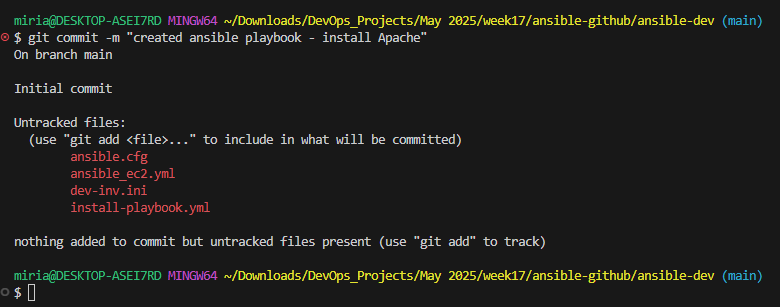

**Self-Hosted Runner Set-up**

Now, let's create a self-hosted runner for our GitHub repository using our Ansible control server. On your new gitHub repository, go to Settings, then Actions, then Runners. Follow the steps to configure a new runner. Remember that the self-hosted runner is your control Ansible server so this is the server you need to configure.

You will need to log into your ansible server to do this. You will need your private keypair to log in. Alternatively, using your AWS connect terminal, connect to your Ansible control server.

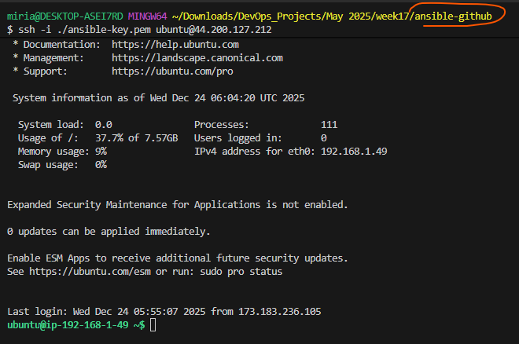


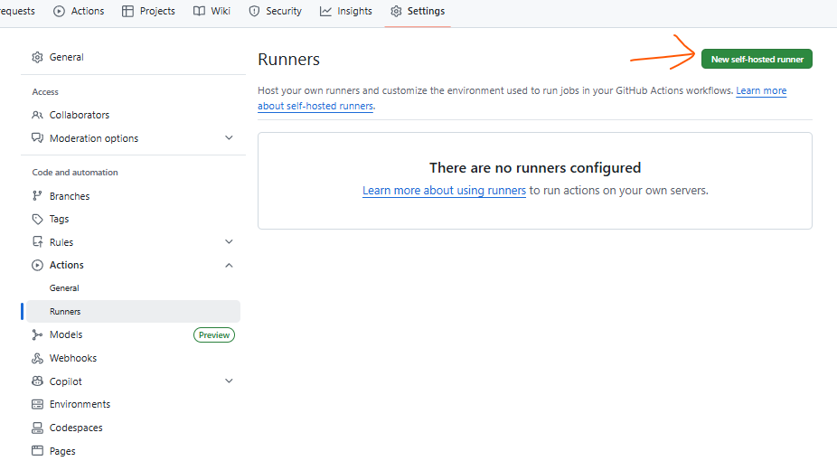

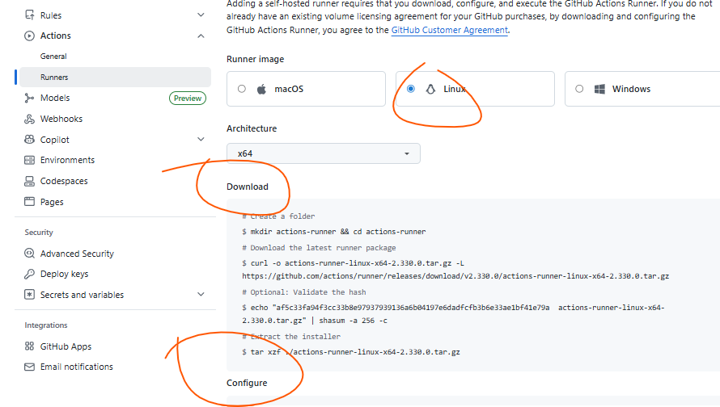

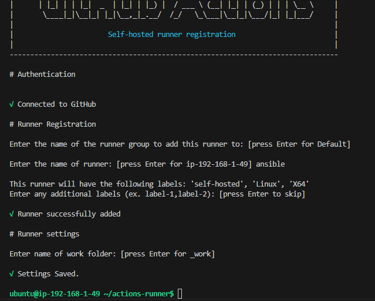

Once you are done with the self-hosted runner setup, check the runner page on your gitHub repository to make sure your runner has been set up correctly.

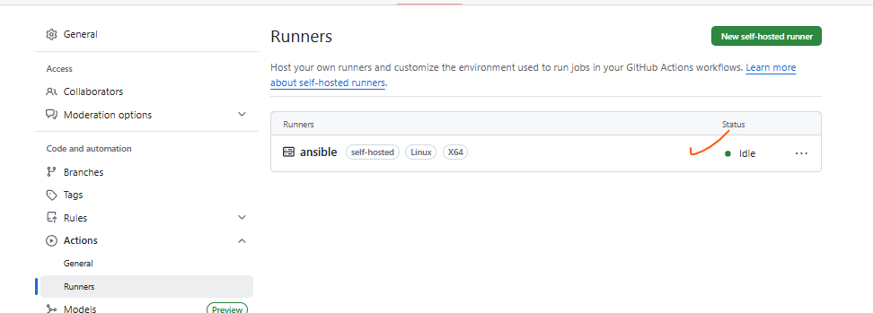

**GitHub Actions Workflow**

Next is to set up github actions yml file. 

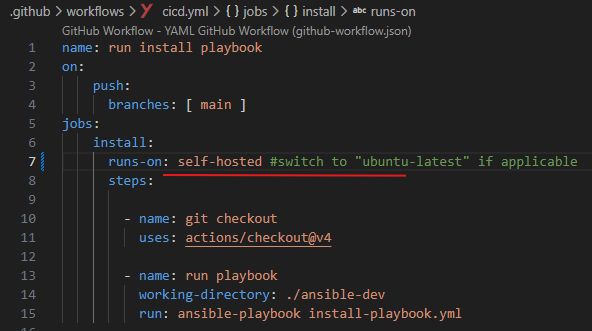

```
name: run install playbook
on: 
    push:
      branches: [ main ]
jobs:
    install:
      runs-on: self-hosted
      steps:
        - name: git checkout
          uses: actions/checkout@v4
        - name: run playbook
          run: ansible-playbook install-playbook.yml
```
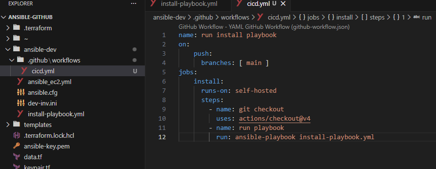

It's time to commit changes and push to gitHub....but first...now is the time to double-check your security group for your servers to make sure port 80 is open. Your ansible playbook is installing Apache2 and we need to be able to access it on Port 80.

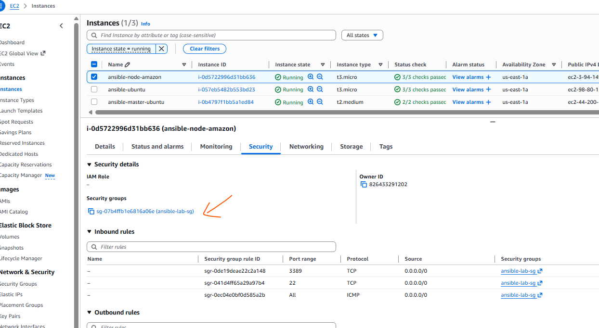

Now, push to your repository and your job should run. If it doesn't start, reconfirm the path where you have your .github/workflows/cicd.yml file

Once your playbook has run successfully, you should be able to view your installation on your servers. 


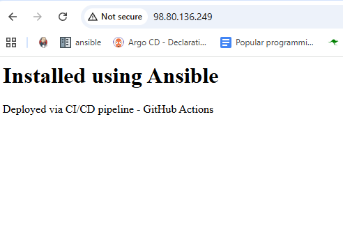

Let's go ahead to update our website using our workflow.

**Testing CI/CD Pipeline with Updates**

Create a file - update_file.txt

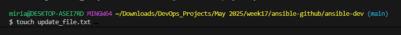

Add this script to your new update_file.txt

```
<!DOCTYPE html>
<html lang="en">
<head>
  <meta charset="UTF-8">
  <meta name="viewport" content="width=device-width, initial-scale=1.0">
  <title>Celebration!</title>
</head>
<body>
  <div class="celebrate-container">
    <div class="celebrate-box">
      <svg class="celebrate-icon" width="64" height="64" viewBox="0 0 24 24" fill="none">
        <circle cx="12" cy="12" r="10" stroke="#ffd6e8" stroke-width="2"/>
        <path d="M7 12l3 3 7-7" stroke="#b5e48c" stroke-width="2" fill="none"
              stroke-linecap="round" stroke-linejoin="round"/>
      </svg>
      <h1 class="celebrate-text">You did it!!! Way to go 😉 🎉</h1>
      <div class="confetti pastel-a"></div>
      <div class="confetti pastel-b"></div>
      <div class="confetti pastel-c"></div>
    </div>
  </div>

  <style>
    body {
      margin: 0;
      padding: 0;
      background: #0e0e0e;
      font-family: Arial, Helvetica, sans-serif;
    }
    .celebrate-container {
      display: flex;
      align-items: center;
      justify-content: center;
      min-height: 100vh;
      text-align: center;
    }
    .celebrate-box {
      position: relative;
      padding: 24px 28px;
      border-radius: 18px;
      border: 3px solid #ffd6e8;
      background: #1a1a1a;
      animation: pop-in 0.8s ease-out;
    }
    .celebrate-icon {
      animation: bounce 1.6s infinite ease-in-out, rotate-icon 3s infinite ease-in-out;
    }
    .celebrate-text {
      margin-top: 14px;
      font-size: 1.8rem;
      color: #c8fff0;
      font-weight: 800;
      animation: zoom-pulse 2s infinite ease-in-out;
    }
    /* Pastel confetti */
    .confetti {
      position: absolute;
      width: 10px;
      height: 10px;
      border-radius: 50%;
      animation: float 2.2s infinite ease-in-out;
    }
    .pastel-a { background:#ffc8dd; left:-18px; top:10px; animation-delay:.3s; }
    .pastel-b { background:#bde0fe; right:-18px; top:26px; animation-delay:.6s; }
    .pastel-c { background:#caffbf; left:50%; bottom:-18px; animation-delay:.9s; }
    
    @keyframes bounce {
      0%,100% { transform: translateY(0); }
      50% { transform: translateY(-6px); }
    }
    @keyframes rotate-icon {
      0%, 100% { transform: rotate(0deg) scale(1); }
      25% { transform: rotate(-10deg) scale(1.1); }
      75% { transform: rotate(10deg) scale(1.1); }
    }
    @keyframes zoom-pulse {
      0%, 100% { transform: scale(1); }
      50% { transform: scale(1.08); }
    }
    @keyframes pop-in {
      from { transform: scale(.8); opacity:0; }
      to { transform: scale(1); opacity:1; }
    }
    @keyframes float {
      0% { transform: translateY(0) rotate(0); opacity:1; }
      100% { transform: translateY(-18px) rotate(45deg); opacity:.2; }
    }
  </style>
</body>
</html>
```

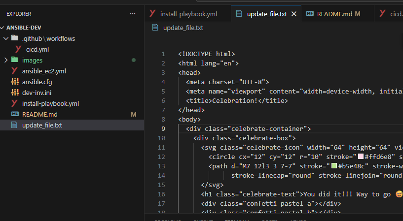

Update your playbook task - install-playbook.yml 
```
---
- name: install package
  hosts: all
  become: true

  tasks:
    - name: Install Apache on Ubuntu/Debian
      package:
        name: apache2
        state: present
      when: ansible_os_family == "Debian"

    - name: Install Apache on CentOS/RHEL
      package:
        name: httpd
        state: present
      when: ansible_os_family == "RedHat"

    - name: Start and enable Apache on Ubuntu/Debian
      service:
        name: apache2
        state: started
        enabled: yes
      when: ansible_os_family == "Debian"

    - name: Start and enable Apache on CentOS/RHEL
      service:
        name: httpd
        state: started
        enabled: yes
      when: ansible_os_family == "RedHat"

    - name: Update index.html with custom text
      copy:
        dest: /var/www/html/index.html
        src: update_file.txt
        mode: '0644'

```

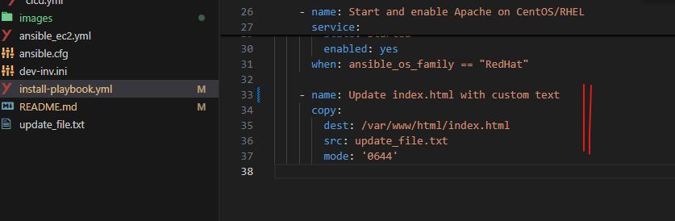

Push your updates to GitHub repository and a new workflow should start running.

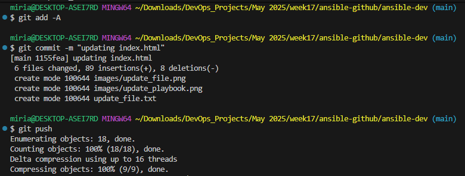

Go back to your servers and view changes!!!


Let me know on discord if you run into any issues with this so I can review and update. I am also happy to get input and happy to help troubleshoot if needed.

Let's get after it!!!

***Remember to clean up practice infrastructure - terraform destroy - if applicable***
