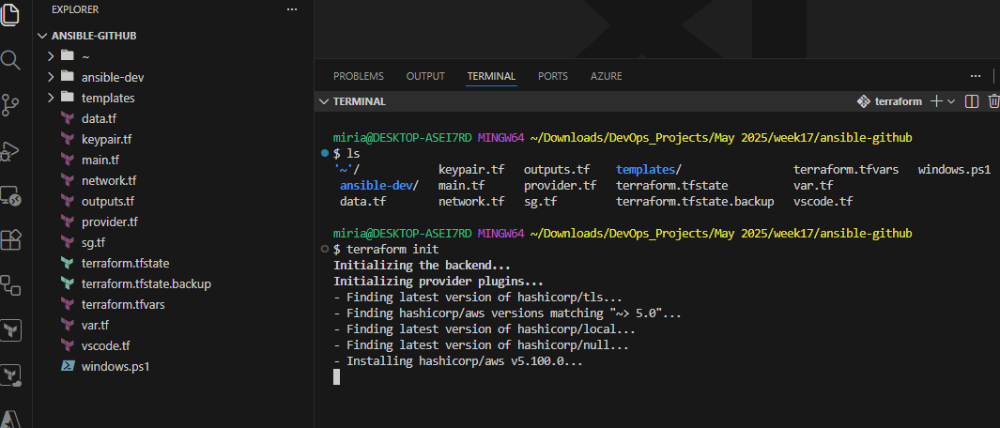

**Introduction**

To improve the reliability, visibility, and traceability of our infrastructure management process, we are implementing a CI/CD pipeline for running our Ansible playbooks. Currently, playbooks are executed manually, which makes it difficult to track execution history, review logs, or ensure consistency across environments. By integrating Ansible with GitHub Actions, this proof of concept (PoC) demonstrates an automated workflow that executes playbooks on code changes, captures detailed run logs, and provides centralized visibility into deployment activity.

**Steps:**

**GitHub Repository - https://github.com/ucheor/Ansible_CI_CD**

Set up your work directory and clone the GitHub repository. 


We will be setting up the Ansible infrastructure and configuring the inventory files using Terraform. Kindly note that this is a test environment. Adjust your backend.tf file by updating your bucket name. This is a demo project. Free free to update, improve or extend for your use. Kindly note the importance of incorporating security measures in handling paswords and private key pairs. Adjust as appropriate.


```
terraform init
```

```
terraform plan
```
I would suggest reviewing the plan output to get an idea of the cloud infrastructure/services you are about to provision. For this project, we will be using one control node and 2 managed nodes. Also note that this terraform code will configure our ansible cfg and inventory files at the same time. Review and adjust as needed.

```
terraform apply
```
'yes' to approve


Save this output because, you might need it later to help you access your applications. 

**Ansible Playbook**

We already have a GitHub Action playbook configured. This playbook will update packages and install Apache into both managed servers and start the Apache service, pulling the inventory/hosts information from the dev-inv.ini file. It will also deploy information from our source code (from update_file.txt) to the index file on our servers so we can view our application.


```
---
- name: install package
  hosts: all
  become: true

  tasks:
    - name: Install Apache on Ubuntu/Debian
      package:
        name: apache2
        state: present
        update_cache: yes
      when: ansible_os_family == "Debian"

    - name: Install Apache on CentOS/RHEL
      package:
        name: httpd
        state: present
        update_cache: yes
      when: ansible_os_family == "RedHat"

    - name: Start and enable Apache on Ubuntu/Debian
      service:
        name: apache2
        state: started
        enabled: yes
      when: ansible_os_family == "Debian"

    - name: Start and enable Apache on CentOS/RHEL
      service:
        name: httpd
        state: started
        enabled: yes
      when: ansible_os_family == "RedHat"

    - name: Update index.html with custom text
      copy:
        dest: /var/www/html/index.html
        src: update_file.txt
        mode: '0644'

```
**Set up GitHub Repository**
To run a GitHub Action workflow, we need a GitHub repository. If you haven't already, go ahead and create your GiHub repository for this project, set up your remote origin.
```
git remote remove origin
git remote -v
```
Should return no output. Update the command below to add your repository link
```
git remote add origin <https://github.com/you/**your_repo**.git>
```

**Self-Hosted Runner Set-up**

We are done with setting up the playbook, now, let's create a self-hosted runner for our GitHub repository using our Ansible control server. To demonstrate in this particular project, we will be using our control plane as our self-hosted runner. It already contains the private ssh keys for our managed nodes and can connect easily to the managed nodes. Since a default GitHub runner needs the ssh private keys to access our servers, using our already configured control plane removes the need to manually configure our ssh credentials on the GitHub secrets. 

My preference overall is to use external encrypted secrets. Adjust to your preference as needed.

To set up a self-hosted runner, on your new gitHub repository, go to Settings, then Actions, then Runners. Follow the steps to configure a new runner. In this case, we are using our Ansible control node server as out GtHub runner. Feel free to use any other server your prefer.

You will need to be logged into your designated self-hosted runner server to do this configuration. Refer to the terraform output from earlier if needed.


Once you are done with the self-hosted runner setup, check the runner page on your gitHub repository to make sure your runner has been set up correctly. Make sure you to finish the last part, configure and run.

*Important: to use your self-hosted runner, confirm that the .github/workflows/cicd.yml file (next step) runs on "self-hosted" or any other label you assigned during runner set up.*


**GitHub Actions Workflow**

Let's review the GitHub Actions file - .github/workflows/cicd.yml and update to your self-hosted runner if applicable (optional).


```
name: run install playbook
on: 
    push:
      branches: [ main ]
jobs:
    install:
      runs-on: self-hosted #switch to "ubuntu-latest" if applicable
      steps:
        
        - name: git checkout
          uses: actions/checkout@v4
        
        - name: run playbook
          working-directory: ./ansible-dev
          run: ansible-playbook install-playbook.yml 
       
```

This ansible playbook is going to run the ansible install-playbook we reviewed earlier and get our application launched on the server (port 80 was exposed during terraform deployment). 

**Review update_file.txt**
This file contains the source code we will be deploying to our Apache servers. 

**Git Push to Trigger GitHub Action Workflow**

Push to your repository and which should trigger the workflow.
Once your playbook has run successfully, you should be able to view the application on your servers using the public IP addresses. 


**Testing CI/CD Pipeline with Updates**

Feel free to update the update_file.txt and view changes on the website by pushing your changes to your GitHub repository.

*Let me know if you run into any issues with this so I can review and update. I am also happy to get input and, happy to help troubleshoot if needed.*

Let's get after it!!!

***Remember to clean up practice infrastructure - terraform destroy - if applicable***
